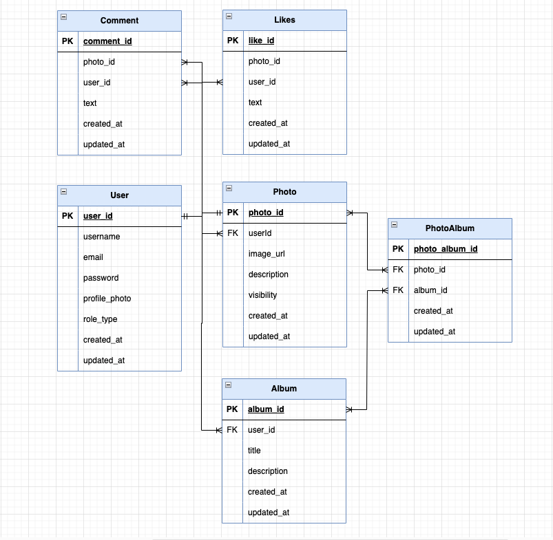

# PhotoShareX

## Description
PhotoShareX is a photo-sharing platform that allows users to effortlessly upload, organize, and share their photos with friends, family, and the others.

## Features
- **CI/CD with GitHub Actions**: Automated testing, building, and deployment processes are set up using GitHub Actions.
- **Kubernetes Deployment**: The application is containerized and deployed on a Kubernetes cluster for scalability and management.
- **RabbitMQ Message Queues**: RabbitMQ is used for reliable message for sending Email And FCM.
- **JWT Authentication**: authenticate users and access protected resources by presenting a digitally signed token.
- **Customized Exception Handling and Logging**: custom exception classes and implementing exception handlers to manage exceptional scenarios and naively output logs to the console.
- **GCP Cloud Storage**: upload images to Google Cloud Platform (GCP) Cloud Storage, securely store them, and obtain short-lived signed URLs for accessing the images in the cloud. Only image files are accepted for upload.

## Schema Table 

